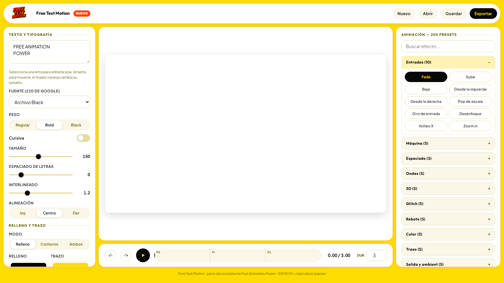
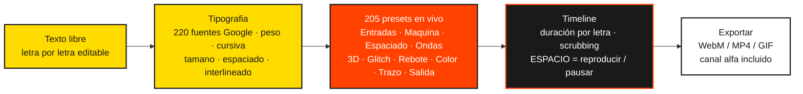

#FREE ANIMATION POWER_TEXT MOTION CONTROL
<p align="center">
  <a href="https://freeanimationpower.org"></a>
  <a href="https://www.youtube.com/@freeanimationpower"></a>
  <a href="https://github.com/freeanimationpower"></a>
</p>

<p align="center">
  
</p>

## 🎬 Vídeos

📺 Canal oficial: [@freeanimationpower](https://www.youtube.com/@freeanimationpower)

| Vídeo | Título |
|---|---|
| <a href="https://youtu.be/AuvKQD07h6M"></a> | [Poniendo a prueba Free Text Motion (demo 1)](https://youtu.be/AuvKQD07h6M) |
| <a href="https://youtu.be/N_2vQB6QtDs"></a> | [Poniendo a prueba Free Text Motion (demo 2)](https://youtu.be/N_2vQB6QtDs) |
| <a href="https://youtu.be/th-aVyyF1To"></a> | [Poniendo a prueba Free Text Motion (demo 3)](https://youtu.be/th-aVyyF1To) |

Estudio de texto animado (motion graphics) del ecosistema [Free Animation Power](https://freeanimationpower.org).

Anima textos en el navegador con 105 presets editables, fuentes de Google, timeline con scrubbing y exportación a vídeo con o sin transparencia.

## Demo en vivo

https://freeanimationpower.github.io/FREE-ANIMATION-POWER_TEXT-MOTION-CONTROL/

## Características



- 205 animaciones editables en 30 familias: Entradas, Maquina, Espaciado, Ondas, 3D, Glitch, Rebote, Color, Trazo, Salida y ambient, Revelados, Elasticos, Liquido, Caminos, Fisica, Profundidad, Luces, Tipograficos, Ambientales, Aterrizajes, Cinematicos, Kinetic Type, Editorial Elegante, Whip y Overshoot, Texturas y Grano, Flujo y Liquido, Minimal Moderno, 3D Profundo, Letras Objeto y Espectaculares (inspiradas en Animation Composer de Mr. Horse)
- Buscador de efectos por nombre en el panel derecho
- Edición por letra integrada en la misma sección de tipografia: al seleccionar una letra en el escenario, fuente, peso, cursiva, tamano y color editan SOLO esa letra; arrastrala para moverla y usa el tirador naranja para redimensionar
- Keyframes por propiedad: anima tamano, espaciado de letras, interlineado, opacidad, rotación y escala con puntos arrastrables en la linea de tiempo (interpolación lineal)
- 220 fuentes de Google en un único selector agrupado por categoria (Display, Sans Serif, Serif, Mono, Script, Decorativas y listas extra); cada nombre se muestra en su propia tipografia
- Deshacer y rehacer: Ctrl+Z / Ctrl+Y y botones en la linea de tiempo (también para movil)
- Diseno responsive completo para tablets y moviles
- Parámetros por preset (velocidad, amplitud, potencia, ecos, etc.) + controles globales: easing (8 curvas), duración de entrada, stagger por letra, animación de salida espejo, bucle
- Tipografia: 16 fuentes de Google curadas + fuente personalizada de Google, peso (400/700/900), cursiva, tamano, espaciado, interlineado, alineacion
- Relleno, contorno o ambos, con colores y grosor configurables; degradados, sombras, motion blur
- Fondo activable o transparencia total (checkerboard en el escenario)
- Exportación WebM (con canal alfa real), MOV (ProRes 4444 con alfa, compatible con After Effects/Premiere), MP4 y GIF (con transparencia), 24/30/60 fps
- Guardar y abrir proyectos JSON (.textmotion) + autoguardado en localStorage
- Atajos: ESPACIO reproduce/pausa, clic en la linea de tiempo para scrubbing

## Correr localmente

Requiere PHP 7.4+ (el archivo PHP solo usa el email gate del ecosistema; todo el motor corre en el navegador):

```
php -S localhost:8000
```

Abrir http://localhost:8000/index.php

En localhost el email gate se omite automaticamente (bypass de desarrollo). En produccion protege la herramienta con la sesion de login del hub.

## Estructura

| Archivo | Uso |
|---------|-----|
| index.php | Versión de produccion con email gate (Hostinger/PHP) |
| docs/index.html | Demo estatica identica, servida por GitHub Pages |

## Stack

HTML5 + CSS3 + Vanilla JS + Canvas 2D. Cero dependencias. Motor de render determinista por tiempo: la misma función dibuja el preview en vivo y cada frame de exportación.
